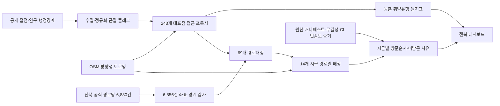

# 전북 금융 접근성 진단·순회 서비스 설계 제안서

- 문서 상태: 제안 v3
- 분석 범위: 전북특별자치도 14개 시군·243개 행정동
- 데이터 기준일: 원천별 상이(`DATASETS.md` 참조); 방법·근거 갱신일 2026-08-13
- 대상 분야: 2026 제4회 전북 청년 AI·빅데이터 경진대회 현안 해결 구현 분야

## 1. 제안 결론

> 전북 243개 행정동의 대면 금융 접근 프록시를 진단하고, 제한된 차량·일정·거점
> 조건에서 14개 시군에 순회 경로일을 배정한 뒤 우선대상 방문 순서를 제안한다.

아이디어는 바꾸지 않고 정읍 시범에서 **전북 전체 의사결정 도구**로 범위를 확장한다.
단순한 취약지도가 아니라 `진단 → 품질 통과 여부 → 거점 선정 → 시군 배정 → 방문 순서 →
미방문 사유`를 하나의 재현 가능한 흐름으로 제공한다.

## 2. 주요 설계 결정

| ID | 결정 | 이유 |
|---|---|---|
| D1 | 분석 모집단을 전북 243개 행정동으로 고정한다. | 243은 군집 수가 아니라 2026 행정경계 기준 분석 행수다. |
| D2 | 전역 순회는 14개 시군 서비스구역으로 나눈다. | 전북 전체 69개 후보를 하나의 경로로 다루는 것보다 일일 운영단위에 맞다. |
| D3 | 모든 시군에 최소 1개 경로일을 배정한다. | 취약도만 최대화해 특정 시군을 전부 제외하는 공간적 불공정을 막는다. |
| D4 | 기본 도로거리 품질을 통과한 대상만 순위화한다. | 대형 연결구간 폴백을 정밀거리처럼 사용하지 않는다. |
| D5 | 단일 가중합 취약점수를 쓰지 않는다. | P1, P2, 전체 방문 대상 수, 이동시간을 사전식으로 비교해 정책 선택을 보이게 한다. |
| D6 | 주민 접근 필요와 차량 운영경로를 분리한다. | 차량 도로거리를 주민의 보행·대중교통 소요시간으로 오해하지 않는다. |
| D7 | 생성형 AI 챗봇은 넣지 않는다. | 유형화는 검증된 탐색형 모델로, 경로는 운영최적화로 정확히 구분한다. |
| D8 | 시연결과와 운영가능 결과를 분리한다. | 장소 승인·실제 차고지·교통시간·차량 재배치가 확정되기 전에는 시연용이다. |

## 3. 해결할 문제와 의사결정자

점포 축소와 디지털 전환은 모바일 금융을 쓰기 어려운 주민에게 대면 업무의 공간·시간 장벽이 될 수
있다. 점포 수만 세면 도로 우회, 접점 운영상태, 거점 사용가능성, 한정된 차량과 일정을 설명할 수 없다.

- 전북특별자치도·시군: 어느 시군과 행정동에 언제 서비스를 배정할지 결정
- 참여 금융기관·우체국: 차량, 차고지, 업무범위, 인력, 운영시간 결정
- 읍면동 현장조직: 경로당 사용승인, 차량 진입, 이용 요일·시간 확정
- 분석팀: 원천, 품질, 설정, 결과, 한계를 같은 산출물에서 역추적 가능하게 제공

## 4. 현재 검증 기준선

| 항목 | 2026-08-13 갱신 산출물 |
|---|---|
| 행정동 | 전북 243개, 14개 시군, 인구와 243/243 조인 |
| 금융접점 | 공개목록 681건, `finance_open=Y` 분석 프록시 643건 |
| 도로거리 | 243/243 수치, 기본품질 239개·대형 연결구간 폴백 4개 |
| 임계치 초과 | 도로거리 3km 초과 71개, 5km 초과 27개; 주민 수가 아님 |
| 경로대상 | 3km 초과 중 기본품질 69개(P1 26개·P2 43개), 품질유보 2개 |
| 농촌 취약유형 | 읍·면 기본품질 155개 적합, Ward `k=2`, 실루엣 0.686, 재표집 ARI 중앙 1.000 |
| 경로당 원천 | 전북 14개 시군 6,880건, 2024-12-31 기준 |
| 경로당 좌표 | 6,856건 좌표화, 6,854건 시군 경계 일치, 실패 24건·불일치 2건 |
| 순회 입력 | 차량 3대·5일·14개 시군 최소 1경로일·09:00~17:00·45분·경로당 4곳 |
| 순회 결과 | 기준선 57개(P1 22), 제약형 57개(P1 26), 제약형 1,055.555km |
| 시간소외 | 7일 주기 가정, 방문 57개는 최대 7일, 미방문 12개는 스케줄 없음 |
| 운영준비 | `demonstration_not_operational` |

`243`은 군집 수가 아니다. 유형 모델은 비교 가능한 농촌 155개에만 적합했고 유형 수는 2개다.

## 5. 범위와 주장 경계

### 제출 범위

1. 전북 243개 행정동 대표점의 직선·도로거리 접근 프록시
2. 농촌 비교집단의 탐색형 취약유형과 규칙형 안전장치
3. 전북 14개 시군 경로당 후보 수집·좌표·행정경계 감사
4. 차량×운영일 용량의 시군 배정과 시군 내 선택방문·시간창 경로
5. 최근접 기준선, 제약형 결과, 미방문·품질유보 사유의 동일 KPI 비교
6. 공간소외과 7일 서비스주기를 결합한 시간소외 표시

### 제출 범위가 아닌 것

- 행정동 대표점 거리를 해당 행정동 전체 고령인구의 거리로 환산
- ATM·지역농협·축협·농어촌버스 실제 소요시간이 포함된 전수 접근성 주장
- 경로당 목록 등재를 장소 사용승인·차량 진입·이용시간 확정으로 해석
- OSM 거리÷40km/h를 실시간 교통시간으로 표현
- 시군 간 차량 재배치·박차·숙박이 이미 스케줄된 것으로 표현
- 생성형 AI 상담·금융상품 추천·개인 위험도 산출

## 6. 시스템 경계와 진실원천

주요 진실원천은 다음과 같다.

- 접점: `data/processed/outlets_validated.csv`
- 직선거리: `data/processed/access_jeonbuk.csv`
- 도로거리: `data/processed/access_road.csv`
- 취약유형: `data/processed/access_typology.csv`
- 유형 검증: `data/processed/typology_evaluation.json`
- 전북 경로당: `data/processed/venues_jeonbuk.csv`
- 전북 순회 시나리오: `data/processed/jeonbuk_route_scenario.json`
- 시나리오 민감도: `data/processed/scenario_evidence.json`
- 원천 URL·기준일·해시: `data/source_manifest.json`
- 도로망 계약: `data/processed/roadnet_metadata.json`
- 검증: `data/processed/validation_checks.csv`

UI와 발표자료는 이 산출물을 읽고 HTML에 과거 수치를 다시 직접 적지 않는다.

## 7. 분석 설계

### 7.1 접근 필요 진단

- 직선거리: 기준선
- 차량 도로거리: OSM 일방통행·도로 우회·양 끝 연결구간 반영
- 접점 프록시: 우체국·은행·신협·새마을금고 `finance_open=Y` 643건
- 품질: 영업상태 근거, 좌표화 방법, 도로 스냅, 폴백, 입력 해시

이 거리는 행정동 내부 대표점 프록시다. 100m/500m 고령인구격자와 보행·대중교통 자료를
결합하기 전에는 `3km 밖 고령인구`를 계산하지 않는다.

### 7.2 농촌 취약유형

전북 243개를 한 군집모델에 강제하지 않는다. 읍·면이면서 `road_distance_primary=Y`인
155개만 비교집단으로 적합하고, 도시 동 84개는 비교대상으로, 폴백 읍·면 4개는 미분류로 남긴다.

- 입력: 최근접 OSM 도로거리, 대표점 기준 직선 3km 내 접점 수, 65세 이상 비율
- 후보: Ward 계층군집 `k=2..5`
- 검증: 실루엣, 80% 재표집 ARI, 군집별 Jaccard, 최소 군집 크기
- 채택: 모든 게이트를 통과한 후보 중 실루엣이 가장 높은 `k=2`; 정책상 원하는 유형 수를 강제하지 않음
- 민감도: 거리·접점 수 `log1p` 대안과 ARI 0.779·군집별 Jaccard 0.706~0.965; 프로젝트 게이트를 통과해도 확정등급으로 사용하지 않음
- 안전장치: 게이트 실패 시 도로거리 3km·농촌 고령비율 중앙값 기반 규칙형 분류로 대체

유형은 정책 대응을 설명하는 탐색 도구지, 개인 위험도·미래예측·법정 금융소외 등급이 아니다.

### 7.3 공간·시간 소외

- 공간소외 프록시: 행정동 대표점의 최근접 금융접점 도로거리
- 시간소외 프록시: 다음 순회 서비스까지의 주기 상한과 해당 주기 내 스케줄 여부
- 시공간 결합: 장거리이면서 해당 주기에 방문되지 않는 대상을 우선 보완 대상으로 표시

현재 시나리오에서 방문 57개는 7일 주기 상한을 갖고, 미방문 P2 12개는 스케줄된 서비스가 없다.
실제 경로당별 요일·시간이 없으므로 정밀한 시간소외 측정이 아니라 **운영주기 시나리오**다.

## 8. 순회 서비스 설계

### 8.1 대상과 후보

1. 도로거리 3km 초과 71개를 찾는다.
2. `road_distance_primary=N` 2개는 순위화하지 않고 품질유보로 출력한다.
3. 나머지 69개를 P1 26개·P2 43개로 나눈다.
4. 전북 경로당 6,880건 중 좌표·시군경계를 통과한 6,854건에서 각 대상 행정동 대표점과 가장 가까운 1곳을 선택한다.
5. 시군별 출발·복귀 후보는 운영 중으로 표시된 우체국을 우선해 대상 중심에서 가장 가까운 곳을 자동 후보로 두되, 운영전에 기관이 덮어쓴다.

### 8.2 운영제약과 목표

- 차량 수·운영일·출발지·복귀지·운영시간·서비스시간·장소수·주기·후보·우선대상은 설정값이다.
- 시군별 최소 경로일로 공간 형평성을 먼저 보장한다.
- 목표는 `P1 방문 대상 수 → P2 방문 대상 수 → 전체 방문 대상 수 → 이동+대기시간 → 최대 경로시간`순이다.
- 시군 내 후보가 최대 7개라 부분집합 DP로 정확 비교하고, 전역 경로일은 사전식 DP로 배정한다.
- 기준선은 같은 시군별 경로일에서 최근접 방문 가능 후보를 반복 선택한다.

### 8.3 현재 결과 해석

| 지표 | 최근접 기준선 | 제약형 | 차이 |
|---|---:|---:|---:|
| 전체 방문 | 57 | 57 | 0 |
| P1 방문 | 22 | 26 | +4 |
| P2 방문 | 35 | 31 | -4 |
| 이동거리 | 1,007.062km | 1,055.555km | +48.493km |
| 추정 이동시간 | 1,510.593분 | 1,583.333분 | +72.740분 |
| 서비스시간 | 2,565분 | 2,565분 | 0 |
| 미방문 | 12 | 12 | 0 |

제약형은 거리를 줄이는 것대신 같은 57개 용량에서 품질을 통과한 P1 26개를 모두 포함한다.
이동량·P2 방문 수와의 교환관계를 숨기지 않는다. 현장에서 P2 최저 보장을 원하면 사전식 목표 앞에
별도 제약으로 추가해야 한다.

## 9. UI 핸드오프

웹 조원은 `data/processed/jeonbuk_route_scenario.json`을 읽고 다음을 구현한다.

### 화면 1 — 전북 접근성

- 14개 시군·243개 행정동 직선/도로거리 전환
- P1·P2·품질유보·유형 필터
- 원지표, 도로 스냅 품질, `population_exposure_valid=false` 표시

### 화면 2 — 취약유형

- 농촌 155개 적합범위와 도시·폴백 미분류 사유
- `k=2..5`, 실루엣, ARI, 군집별 Jaccard, 대표 읍·면
- 규칙형 대체 유형과 원지표

### 화면 3 — 전북 순회 시나리오

- 차량·운영일·시군별 출발/복귀·운영시간·서비스시간·장소수·주기 입력
- 14개 시군 경로일 배정과 5일×3대 일정표
- 선택 거점·방문순서·도착/서비스/복귀·이동/대기/서비스시간
- 기준선·제약형·미방문·품질유보 비교
- `operational_ready`, 관측 교통 여부, 장소·차고지 승인, 시군 간 재배치 모형화 여부

### 화면 4 — 데이터·한계

- 원천·기준일·행수·라이선스·해시
- 6,880건 원천→6,856건 좌표→6,854건 경계일치 흐름
- 깨끗한 체크아웃 무결성·브라우저 엔진 CI와 별도 원천 계보 검증 결과·재현 명령
- 검증되지 않은 운영가정과 결과에 미치는 방향

UI는 `status`, `actual_traffic_time`, `interzone_repositioning_modeled`, 차고지·장소 승인상태,
시간창 원천, 품질유보를 숨기면 안 된다. 현재 구현은 `docs/demo-jeonbuk/`이며 전북 243개
행정동, SGIS 실제 경계, OSM 주요도로, 차량별 방향성 운행경로, 활성 경로 도로노드 표본,
색·크기 지표 선택, 시군 필터, 최소·기본·확대·사용자 운영조건 비교를 제공한다. 계산 수식과
군집·경로 이론은 `methodology.html`로 분리해 발표자와 심사자가 같은 근거를 확인할 수 있다.
기존 정읍 URL은 전북 화면으로 이동한다.

## 10. AI·생성형 AI 원칙

- 탐색형 Ward 군집만 분석모델로 구분하고 안정성·민감도·규칙형 대체를 공개한다.
- Dijkstra, 부분집합 DP, 시군 경로일 DP는 운영최적화지 AI라고 표현하지 않는다.
- 생성형 AI는 코드·문서·반례 검토 보조로 공개하고 수치·출처·라이선스는 스크립트와 참가자가 검증한다.
- 생성형 AI 챗봇을 추가하는 것보다 문제에 맞는 유형화·경로배정·검증 증거를 우선한다.

## 11. 운영설계와 남은 확인

| 주체 | 필요 확정사항 |
|---|---|
| 전북특별자치도·14개 시군 | 시군별 우선대상, 장소 협조, 주민 안내, 시군 간 운영 조정 |
| 참여 금융기관·우체국 | 차량 3대 가정의 현실성, 실제 차고지, 운전자 근무, 업무범위, 현금·보안·준법 |
| 읍면동·경로당 | 사용승인, 차량 진입, 요일·시간, 휴무일, 예약·안내 |
| 분석팀 | 실차 주행시간 보정, 시군 간 재배치시간, 품질유보 2개 대체지표, 갱신·검증 |

개인 식별정보·거래정보는 수집하지 않는다. 실제 예약·현금·본인확인·민원·사고대응은 참여기관의
기존 보안·준법 절차 안에서 운영한다.

## 12. 성과지표

### 현재 측정 가능

- 243개 도로거리 산출률·기본품질·폴백 비율
- 경로당 6,880건의 좌표화·시군경계 일치·실패율
- 14개 시군 경로일 최소배정 충족률
- P1·P2·전체 방문 수와 미방문 사유
- 이동거리·이동·대기·서비스시간·최대 일일 운영시간
- 방문 대상의 다음 서비스까지 주기 상한과 미방문 스케줄 여부
- 입력 해시, 동일 입력 재계산, 오프라인 검증 통과 여부

### 추가 데이터 후

- 100m/500m 격자별 65세+ 인구가중 접근거리·기준거리 밖 인구
- 실제 경로당 시간창·차량 재배치를 반영한 시간소외
- 회차당 방문자·상담·기초업무 처리건수의 비식별 집계값

## 13. 게이트와 완료 조건

### Gate A — 데이터·방법

- 243개 접근성, 155개 유형 적합, 6,880개 거점 원천이 서로 다른 모집단임을 명시
- 입력 해시, 품질플래그, 64개 무결성·6개 브라우저 엔진 검증 통과
- `3km 밖 고령인구`와 같은 금지된 환산 주장 없음

### Gate B — 전북 거점·경로

- 69개 경로대상 모두 같은 행정동에 경계감사 후보 1개 이상
- 14개 시군 방향성 행렬·상호도달 폴백·연결구간 공개
- 같은 입력에 같은 경로 결과

### Gate C — UI 통합

- 정읍 고정 수치가 아니라 전북 산출물에서 생성한 243개 행정동 화면
- 차량·운영일·운영시간·서비스시간·방문상한 입력과 최소·기본·확대안 비교
- UI 수치와 Python 기준 산출물 일치, 잘못된 입력 증분 거부
- 개별 일정·방문순서 상세 화면은 웹조 통합 범위로 남김

### Gate D — 운영 확정

- 14개 시군별 차고지·거점 승인·시간창·실차시간·시군 간 재배치 확정
- 확정 전까지 `operational_ready=false`

## 14. 평가항목 대응

| 평가항목 | 설계 대응 | 제출 증거 |
|---|---|---|
| 문제 해결성 | 243개 진단을 14개 시군 배정·69개 거점·57개 방문결과로 연결 | 시나리오 JSON, 설계계약 |
| 데이터 활용성 | 접점·인구·행정경계·OSM·6,880개 거점 융합과 품질표시 | `DATASETS.md`, 품질보고서, 검증 CSV |
| 분석·AI 방법 적합성 | 155개 농촌 유형 검증·규칙형 대체·사전식 경로배정·기준선 | 유형 평가 JSON, 단위테스트, 결과 비교 |
| 구현 완성도 | UI 독립 입력·행렬·일정·결과 계약과 오프라인 검증 | `SCENARIO_CONTRACT.md`, `verify_offline.sh` |
| 파급성·활용성 | 설정값 변경, 시군별 배정, 미방문·시간소외, 운영전 게이트 | 설정 JSON, 운영표, 한계 플래그 |
| 발표력 | “거리 최소”와 “P1 전부 커버”의 교환관계를 같은 57개 수치로 설명 | 기준선 대비표, 질의응답 |

## 15. 완료 정의

다음을 모두 만족해야 전북 전체 구현 분야 제출물로 본다.

- 243개 분석, 14개 시군, 69개 경로대상, 2개 품질유보가 동일 스냅샷에서 일치한다.
- 전북 6,880개 거점 원천과 좌표·경계·실패 분할이 재현된다.
- 최소·기본·확대·사용자안의 시군별 배정·P1/P2·미방문 수가 UI에 표시된다.
- 정읍 고정 수치가 아니라 전북 243개 산출물을 읽는 UI가 실제로 작동한다.
- 유형화가 검증 게이트를 통과하거나 규칙형 대체가 제공된다.
- 차고지·장소승인·시간창·교통·재배치 미확정을 숨기지 않는다.
- `bash verify_offline.sh`가 통과하고 발표자료가 같은 산출물 해시를 사용한다.
